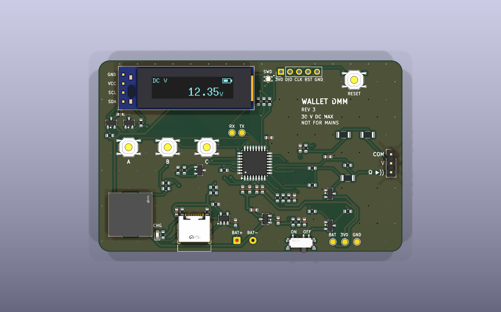
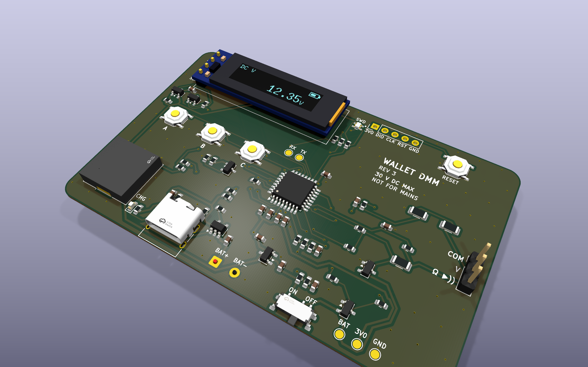
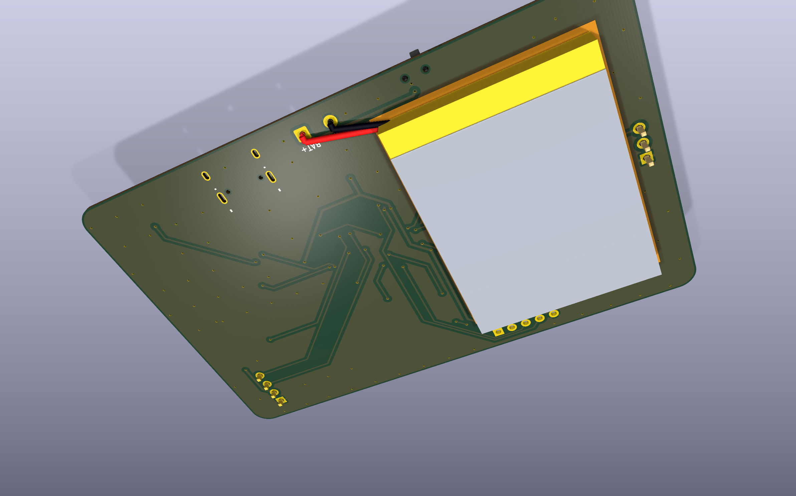

# wallet_dmm

A multimeter the size of a credit card: DC volts, resistance, continuity and
diode test, shown on a 0.91" OLED, with three buttons, an RGB LED and a piezo
beeper. It runs from a small LiPo that charges over USB-C and is built around
an STM32L051K8, with Rust firmware and a simulation of the whole thing.



This is revision 3. Rev 1 (the October 2024 JLCPCB order) is commit `a01ea68`;
rev 2 is the `v2` branch.

| | |
|---|---|
| Inputs | COM, V (10 MΩ) and Ω (resistance, continuity, diode) on a 2.54 mm header |
| Voltage | −30 V to +31 V; negative readings through a 1.55 V mid-rail bias |
| Resistance | 0–200 kΩ against a 0.1 % 10 kΩ reference, 150 kΩ–10 MΩ against 1 MΩ, autoranging |
| Continuity, diode | 0.3 mA test current, open-circuit 3.0 V |
| Overload | both inputs survive ±30 V DC; not for mains or anything above 30 V |
| Power | 3.7 V LiPo (protected cell), 100 mA USB-C charging, 3.0 V rail, about 5 µA off |
| Board | 85.6 × 54 mm (ID-1 card), 2 layers, 0.8 mm FR4 |

## Changes from rev 1 and rev 2

- **Power.** The CR1025 (rated 0.1 mA continuous) could not run an OLED. It is
  replaced by a LiPo charged from USB-C (MCP73831), a 1 µA 3.0 V LDO that
  stays on while the MCU sleeps in Stop mode, a slide switch that disconnects
  the battery, bulk decoupling, and a load switch (Q1/Q2) that cuts the OLED
  module's supply.
- **Piezo.** The always-running 555 and its two MOSFETs are gone. The MCU
  drives the piezo push-pull from TIM22 CH1/CH2 on PB4/PB5, which gives
  6 Vp-p from 3 V and draws nothing when silent.
- **Programming.** SWD is on PA13/PA14 with NRST, with nothing else on those
  pins. USART1 (PA9/PA10, also the ROM bootloader) is on test pads.
- **Measurement.** Separate V and Ω inputs. The V input is a 9.87 MΩ divider
  biased to a mid-rail reference, with a hold capacitor because the ADC wants
  a source below 50 kΩ. The Ω input has two reference ranges; its drive nodes
  are clamped to ground and the battery, so a voltage on it pushes at most
  2.5 mA into the cell instead of into the MCU or the 3.0 V rail. What the
  MCU pins' own clamps still pass would lift the rail while the MCU sleeps
  (the LDO cannot sink current), so a TL431 (U4) holds it below 3.32 V.
- **Everything else.** A resistor for each LED colour, with the anode on the
  battery so green and blue have headroom. The MCU's calibrated internal
  sensor replaces the TO-92 MCP9700. Decoupling sits at the pins. Every part
  is stocked by JLCPCB and carries its LCSC number. All libraries are in the
  repo.

## Layout of the repository

- `hardware/`: KiCad 10 project (schematic, board, project rules, footprints
  for the RGB LED and the OLED module, 3D models for every part)
- `scripts/`: generators for the schematic, board and 3D models, the
  autorouter wrapper, the fab-file export and the renders
- `fab/`: Gerbers, drill files, BOM and pick-and-place for JLCPCB, schematic
  and assembly PDFs
- `firmware/`: Rust firmware and its simulation (see
  [firmware/README.md](firmware/README.md))
- `docs/`: renders of the board and the simulation results

## Building

Everything runs in the dev shell (`nix develop`, or direnv).

```sh
./scripts/build.sh          # schematic -> ERC -> board -> DRC -> fab/
```

The schematic and board are generated by `scripts/gen_schematic.py` and
`scripts/gen_pcb.py`; edit those rather than the KiCad files, or the next
build will overwrite the change. Tracks come from `hardware/routes.json`.
After moving parts or changing the netlist, route again with Freerouting:

```sh
kicad-cli sch export netlist --format kicadsexpr -o build/wallet_dmm.net hardware/wallet_dmm.kicad_sch
python3 scripts/autoroute.py build/wallet_dmm.net
```

The build stops on any ERC or DRC error and checks that the board matches the
schematic.

The renders in `docs/renders/` and a GLB of the populated board
(`build/wallet_dmm.glb`, for any glTF viewer) come from:

```sh
./scripts/render.sh
```

Most parts use KiCad's own 3D models; the switches, buzzer, USB-C socket and
RGB LED use the manufacturers' models (via EasyEDA). The OLED module and the
battery are drawn by `scripts/gen_models.py`, which lights the OLED's pixels
with the firmware's volts screen:

```sh
nix develop .#models -c uv run --with cadquery python scripts/gen_models.py
```

## Ordering from JLCPCB

Upload `fab/wallet_dmm-gerbers.zip`: 2 layers, **0.8 mm**, 1 oz, any colour,
HASL lead-free or ENIG. For assembly, choose top side and upload
`fab/bom-jlcpcb.csv` and `fab/cpl-jlcpcb.csv`. In the placement preview,
check the orientation of U1 (pin 1 dot), U2, U3, Q1, Q2, D2, D3, D1 (cathode)
and D4 (anode corner, the dot in the silkscreen) before confirming.

Solder these by hand afterwards:

- J3: a 0.91" 128×32 SSD1306 I2C module, flat on the board, header pins cut
  short. Match the module's pin labels to the silkscreen (GND VCC SCL SDA).
- J2: a 3-pin header or the probe leads (COM, V, Ω).
- J5: the battery wires from the back, BAT+ to the square pad.
- J4 stays empty; hold a header in it for an ST-Link, or solder one while
  developing.

## Battery

A LiPo pouch cell with its own protection circuit, up to 30 × 40 × 4 mm,
taped to the marked area on the back (no pins poke through there). Charging
runs at 100 mA, so use 150 mAh or more; R3 sets the current (1000 V / R3).

## Bring-up

1. Before connecting anything, check that BAT and 3V0 (TP3, TP4) are not
   shorted to GND.
2. Connect the battery and slide SW5 to ON. TP4 reads 2.94–3.06 V. If it
   reads 0 V, the switch is the other way round from the silkscreen: fix the
   labels in `scripts/gen_pcb.py`.
3. Plug in USB-C: the CHG LED lights while the cell charges and goes out when
   it is full.
4. Flash over SWD (ST-Link on J4: 3V0, SWDIO, SWCLK, NRST, GND). Holding
   RESET while connecting works if firmware has put the MCU to sleep.
5. With the firmware running ([firmware/README.md](firmware/README.md)):
   short V to COM in DC V and hold C for 3 s to store the zero; do the same
   with the Ω leads in Ω mode. Then put 5–30 V on the V input, measure it with another
   meter, and send `cal <volts>` over the UART (TP2) to set the gain.

## Firmware

The firmware is in [firmware/](firmware/): Rust and Embassy, with all the
maths and the UI in a host-tested crate. Its README covers the buttons,
calibration, flashing and the simulation. The pins:

| Pin | Use |
|---|---|
| PA0 ADC_IN0 | E_LO: the low-range drive node, through R18 |
| PA1 ADC_IN1 | VMID, the bias under the V divider |
| PA2 | VMID_EN: high while measuring volts |
| PA3 | OHM_HI: high-range drive (1 MΩ), analog otherwise |
| PA4 ADC_IN4 | V input divider |
| PA5 ADC_IN5 | Ω input, through R21 into C13 |
| PA6 | OHM_LO: low-range drive (10 kΩ), analog otherwise |
| PA7 | VBUS present (high on USB) |
| PB1 ADC_IN9 | switched battery ÷ 2 |
| PA8, PA15, PB3 | LED blue, red, green (low = on; PA15/PB3 are TIM2 CH1/CH2) |
| PB4, PB5 | piezo, TIM22 CH1/CH2 in antiphase, about 4 kHz |
| PB6, PB7 | I2C1 to the OLED (address 0x3C) |
| PC15 | OLED power: high = on |
| PA11, PA12, PC14 | buttons A, B, C to GND (enable pull-ups) |
| PA9, PA10 | USART1 TX/RX on TP1/TP2 |

## Simulation

`firmware/simulate.sh` runs the front end in ngspice, feeds it through a
model of the ADC into the firmware's own maths, and runs the release binary
in Renode on an emulated STM32L051. Across 200 simulated boards with 1 %
parts, calibrated volts are within ±4 mV up to ±5 V and ±33 mV at ±30 V,
and ohms within ±0.34 % from 1 kΩ to 100 kΩ. The details and plots are in
[firmware/README.md](firmware/README.md#simulation) and
[docs/simulation/](docs/simulation/).


## Renders

| Front | Back, with the battery |
|---|---|
|  |  |
