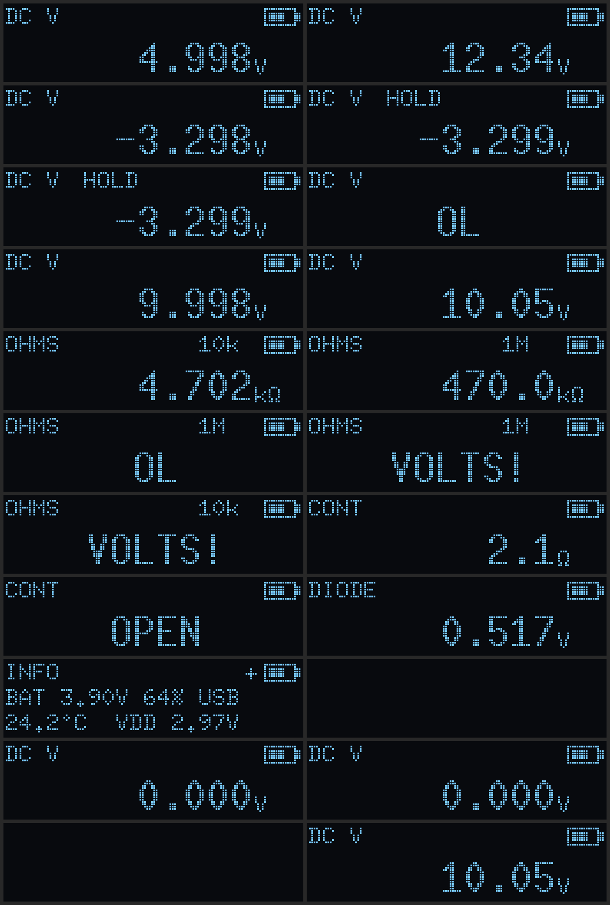

# Firmware

Rust and Embassy on the STM32L051K8, with a simulation of the analog front
end, the ADC and the firmware itself.

- `core/`: everything that is not a pin. The measurement maths (divider,
  references, VDDA from VREFINT, battery, temperature), the UI state machine
  and the 128×32 screen layout. `no_std`, tested on the host.
- `app/`: the firmware binary. Pins, ADC registers, EEPROM, Stop mode.
- `sim/`: the front end in ngspice, an ADC model that feeds `core`, and plots.
- `renode/`: the release ELF running on an emulated STM32L051 with a model
  of the front end behind its ADC.

## Using the meter

| Button | Short press | Long press |
|---|---|---|
| A | next mode: DC V, Ω, continuity, diode, info | 1.5 s: off |
| B | hold the display (again to release) | |
| C | relative: show readings against the current one | 3 s, probes shorted: store the zero |

Any button wakes the meter from off. It turns itself off after 5 minutes
without a press, or when the battery falls below 3.35 V, unless USB is
connected; the blue LED blinks while it is.

- **DC V**, on the V input: −30 V to +31 V, "OL" beyond. Readings are
  averaged while the input holds still and start over when it moves.
- **Ω**, on the Ω input: the 10 kΩ range up to 200 kΩ, the 1 MΩ range above
  (back below 150 kΩ), "OL" when open. Before each reading the drive is
  pulled low to look for a source on the input; "VOLTS!" and the red LED
  mean there is one, and nothing is driven until it goes.
- **Continuity**: beeps, with the green LED, below 50 Ω. Reads every 30 ms.
- **Diode**: forward voltage at up to 0.3 mA, "OL" when open or reversed.
- **Info**: battery voltage and charge, USB, the MCU's temperature, VDDA.

## Calibration

Stored in the data EEPROM, so it survives power-off and reflashing.

- **Zero** (volts offset, lead resistance): short the probes in DC V, Ω or
  continuity and hold C for 3 s.
- **Gain**: put a steady 5–30 V on the V input, measure it with a meter you
  trust, and send `cal <volts>` (for example `cal 10.047`) to USART1 RX on
  TP2. The firmware replies with the new gain, or with why it refused (not
  in DC V, below 1 V, or more than 5 % off).

## Log

USART1 TX on TP1, 115200 8N1. One line per reading, with µV, mΩ, the rail
(µV), the battery (µV) and the temperature (0.1 °C):

```
DC V 12335998 vdda 2968467 bat 3899510 temp 241
OHMS 470046813 vdda 2968467 bat 3899782 temp 241
button A long
off
```

## Building and flashing

In the firmware dev shell (`nix develop .#firmware` at the repository root):

```sh
cargo test -p dmm-core     # host tests, in firmware/
cd app
cargo build --release      # 35 KB of the 64 KB flash
cargo run --release        # flash over SWD (ST-Link on J4) with probe-rs
```

The app builds for `thumbv6m-none-eabi` through `app/.cargo/config.toml`,
so run cargo from `app/`. If the meter is off (Stop mode), probe-rs cannot
attach: hold RESET while it connects, or add `--connect-under-reset` to the
runner in that file.

## Simulation

```sh
./simulate.sh    # in firmware/; refreshes docs/simulation/
```

It runs four layers:

1. `cargo test`: the maths and UI.
2. `sim/spice.py`: the front end in ngspice. DC sweeps of both inputs,
   30 V on each input with the MCU running and asleep, the continuity and V
   settling transients, and 200 boards with 1 % resistors (0.1 % for R17).
3. `dmm-sim`: turns those node voltages into ADC codes with offset, gain
   error, INL, noise, 16× oversampling and each board's own ADC errors, then
   into readings through `core`, exactly as the firmware does. It also draws
   each screen with the firmware's renderer.
4. `renode/run.py`: the release ELF on an emulated STM32L051. A Python
   peripheral stands in for the ADC and solves the front end from the GPIO
   state the firmware sets up. A scripted session presses buttons, changes
   what the probes touch, and types a calibration command. The SSD1306's I2C
   traffic is decoded back into frames.

Results, in [docs/simulation](../docs/simulation/):

| Check | Result |
|---|---|
| Volts, uncalibrated | ±61 mV up to ±5 V, ±505 mV at ±30 V |
| Volts, zero and gain calibrated | ±4 mV up to ±5 V, ±33 mV at ±30 V |
| Ohms, leads zeroed, up to 100 Ω | ±3.1 Ω |
| Ohms, 1 kΩ–100 kΩ | ±0.34 % |
| Ohms, 1 MΩ / 10 MΩ | ±1.5 % / ±3.6 % |
| Diode test, 1N4148 / red LED | 0.516 V / 1.704 V (true 0.516 / 1.705) |
| 30 V on the Ω input | 2.5 mA into the battery, 65 mW in R17 |
| Same, MCU asleep | rail held at 3.32 V by U4 (29.5 V without it) |
| Continuity | beeps at the first reading after contact, 15 ms |
| V input settling | 161 ms to 5 mV; readings every 200 ms |



The Renode session (`session.md` there) checks the log line, LEDs, piezo and
OLED power at the end of each step, including hold, overload on both inputs,
autoranging, power-off and wake, and the zero and gain surviving a reset.

Renode 1.16 differs from the real chip in ways that `run.py` works around:
a system reset clears flash and pulls every GPIO input low (the reset macro
reloads the ELF and lets the buttons go), EXTI_IMR resets to 0 instead of
0x3F840000 (which would mask USART1's interrupt), and PC14 does not reach
the EXTI (button C drives the EXTI line directly).
